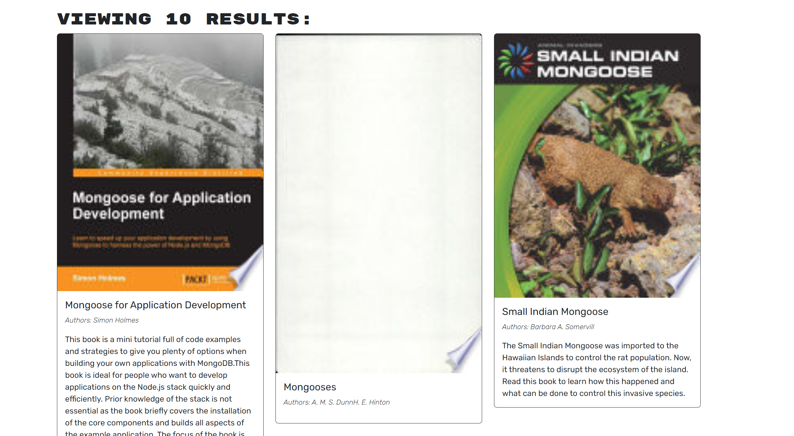
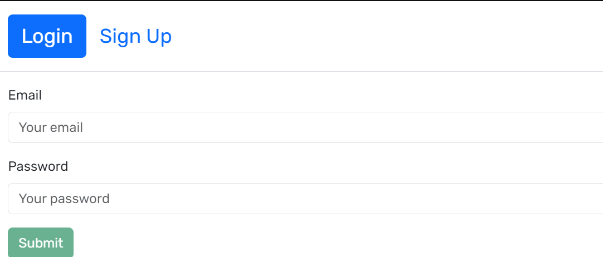
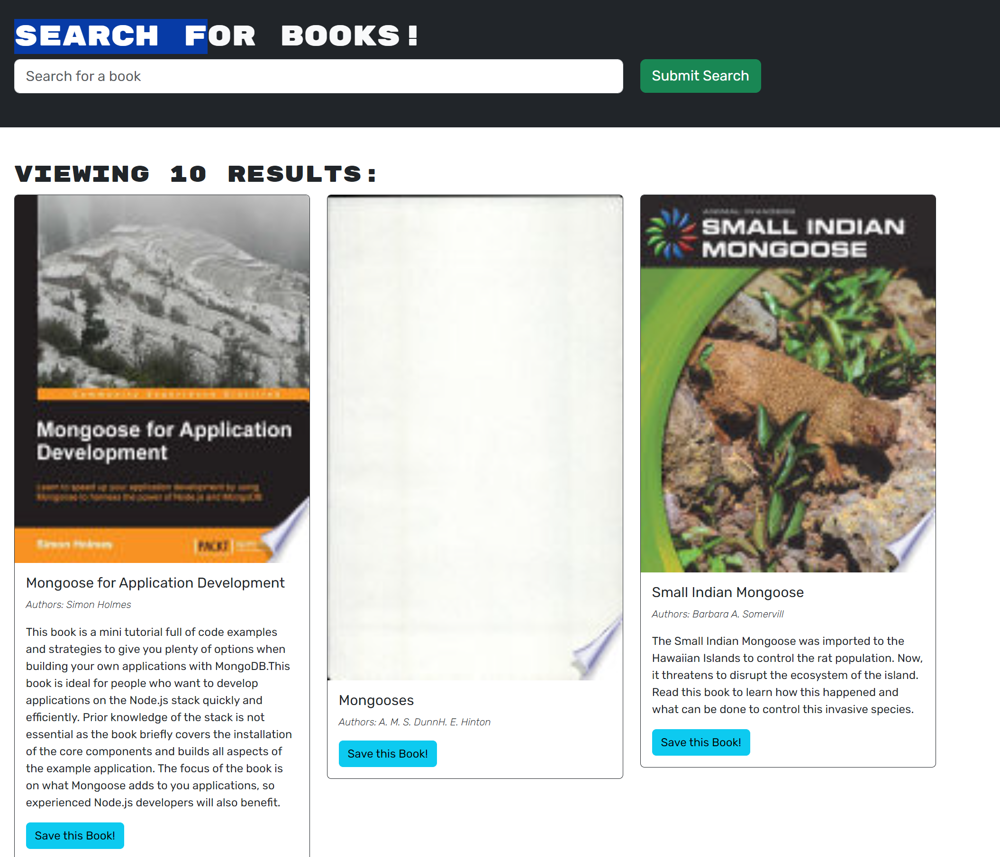
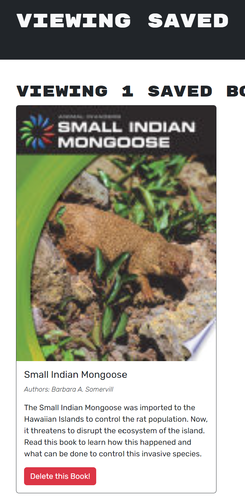
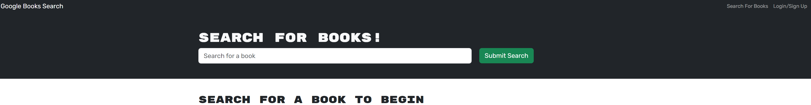

# Book_Search_Engine

## Description

Google Book Search is a project which uses GraphQL queries and mutations to fetch and modify data. The bcrypt authentication middleware is used in a GraphQL API. Requests communicate with the Apollo Server. The deployment uses MongoDB Atlas and Heroku.

## Installation

N/A

## Usage

Upon entering the application, the user is presented with a menu to Login/Signup or to enter a search books from Google Books. When entering input for a search, a submit button can be clicked to search for the results. The initail page is to search for books and the option is also a menu option. An input field allows the user to enter the search for books matching the criteria entered. If the user is not logged in and clicks submit, the search will display the book's title, author, description, and an image.

When the user clicks on Login/Signup a modal appears to toggle between logging in or signing up. The Login screen presents inputs for the user's email and password. After entering the Login inputs correctly, the user is authenticated and returned to the Home Page to enter a book search.

When the user toggles to the Signup modal, inputs for the new user's username, email, and password are displayed. The new account is created upon clicking Submit. Again, if the email is in a and the password are in a valid format, the user is logged in and returns to the default page to search for books.

After loggin in, the menu options are to either Search For Books, View Saved Books, or to Logout. Entering input to search for a book and clicking Submit will run a search on the Google Books URL and query books on the site to return matches from the search input field. The search will display the book's title, author, description, an image, and a button to save the result.  

When the user clicks on a Save Button from one of the results, the information is saved to the users account.

When the option for viewing Saved Books is selected, all of the book's titles, authors, descriptions, and images saved are displayed and a button to Delete the book from my account is available.

When the Delete this Book button is clicked, the book is removed from the user's list.

The user has the ability to logout.

GitHub Repository: https://github.com/rethomas67/Book_Search_Engine/
Live page link: https://retbooksearch-3af1304d34a1.herokuapp.com/
